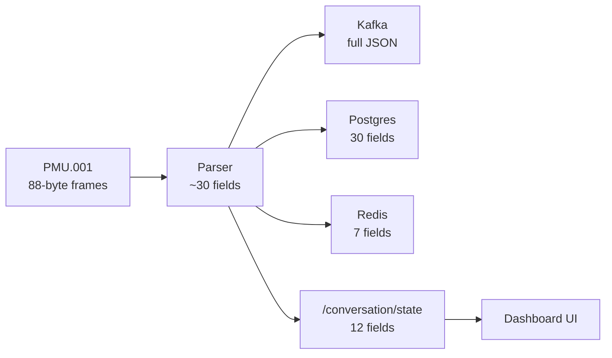

# PMU Data vs Dashboard — Full Analysis

For **PMU.001** (`172.24.105.87:4713`), each DATA frame is 88 bytes. After CFG2 handshake, the parser unpacks it into a `Reading` object. The dashboard only sees a **small slice** of that via `/conversation/state`.

---

## What We Get From PMU Packets

### Frame structure (every ~33 ms @ 30 fps)

| Layer | Fields | PMU.001 value |
|-------|--------|---------------|
| **Header** | SYNC, frame size, IDCODE, SOC, FRACSEC, CRC | 60 Hz nominal, CRC validated |
| **STAT word** | 9 status flags (sync error, data error, GPS lock, trigger, etc.) | Parsed, stored in Kafka/Postgres — **not shown in UI** |
| **Phasors (6)** | Polar float: magnitude + angle | See mapping below |
| **Frequency** | Hz | ~60.0 |
| **ROCOF** | Hz/s | Small drift |
| **Analogs (3)** | ANA1, ANA2, ANA3 | Only first 2 used |
| **Digital** | 16-bit status word | Parsed, barely shown |

### PMU.001 channel mapping (CFG2)

| CFG2 channel | Maps to | Used? |
|--------------|---------|-------|
| `PZR.AV` | VA (voltage A) | Yes — plotted |
| `PZR.BV` | VB (voltage B) | Yes — plotted |
| `PZR.CV` | VC (voltage C) | Yes — plotted |
| `PZR.AI` | IA (current A) | Yes — plotted |
| `PZR.BI` | — | **Read from wire, then discarded** |
| `PZR.CI` | — | **Read from wire, then discarded** |
| `ANA1` | MW | Parsed, **not plotted** |
| `ANA2` | MVAR | Parsed, **not plotted** |
| `ANA3` | — | **Discarded** |
| Digital word | `digital` (hex) | Stored, **not plotted** |

### Backend computes (but dashboard doesn't receive)

These exist in `parser.Reading` and go to **Kafka/Postgres**, but **not** to `/conversation/state`:

- Voltage imbalance %
- Sequence components (V+, V−, V0)
- Inter-phase angle differences (VAB, VBC, VCA)
- MVA, power factor, leading/lagging
- STAT decoded flags (GPS lock, trigger, data error)
- Real/imaginary phasor components (R/I, not just mag/angle)
- Frequency deviation from 60 Hz

---

## Data Flow Gap

The UI is fed only: **frequency, ROCOF, MW, MVAR, VA/VB/VC/IA mag+angle**, plus connection stats.

---

## Page-by-Page Analysis

### 1. Overview

**Currently showing**
- KPIs: PMU count, healthy/degraded/offline, avg availability, total FPS
- **Chart:** System frequency (area chart) — `trends[].frequency`
- Map: PMU location, connection status, packet loss color
- Alerts: stream events + connection health
- Regional health summary

**Not plotted (but available in trends)**
- MW, MVAR (in `mergedTrend` but unused)
- ROCOF
- Any phasor data

**Could add**
| Plot | Data source | Value |
|------|-------------|-------|
| MW / MVAR trend | `trends[].mw/mvar` | Already in API — quick win |
| ROCOF overlay | `trends[].rocof` | Frequency stability |
| Voltage magnitude trend | Extend API with phasor history | Phase voltage monitoring |
| Digital status bits | `digital` field | Breaker/relay states |
| GPS lock indicator | `stat_decoded.pmu_sync_status` | Time quality alarm |

---

### 2. Device Inventory

**Currently showing**
- Table: name, substation, region, voltage class, vendor, IP, FPS, status, availability, latency
- **Charts:** Region pie, voltage bar, vendor radar — **metadata only, not live PMU data**

**Not shown**
- Live frequency, phasors, power
- Real latency (current "latency" is **estimated** from FPS + ROCOF, not network RTT)

**Could add**
| Plot | Data source | Value |
|------|-------------|-------|
| Mini sparkline per PMU | `trends[].frequency` | At-a-glance health in table |
| Last-seen frequency | `lastReading.frequency` | Quick sanity check column |
| Quality reject rate | `qualityRejects / totalFrames` | Data integrity column |
| STAT alarm badge | GPS lock, data error flags | Operational status |

---

### 3. PMU Detail Drawer

**Currently showing**
- Metadata: substation, region, voltage, vendor, IPs
- Stats: total frames, approx FPS, last event, last error

**No charts at all**

**Could add**
| Plot | Data source | Value |
|------|-------------|-------|
| Live frequency gauge | `lastReading.frequency` | 60 Hz ±0.05 band |
| Phasor polar diagram | VA/VB/VC/IA | Classic PMU visualization |
| ROCOF mini chart | `trends[].rocof` | Stability at device level |
| Power summary | MW, MVAR, MVA, PF | From parser (needs API extension) |

---

### 4. Data Frames

**Currently showing**
- CFG2 labels (static): 6 phasors, 3 analogs
- Live text stream: frequency, ROCOF, connection status
- **Phasor cards:** VA, VB, VC, IA magnitude + angle (latest snapshot)
- **Chart:** Frequency + ROCOF dual-axis line chart

**Not shown**
- MW, MVAR live values (labeled in CFG2 but not displayed)
- IB, IC (PZR.BI, PZR.CI — not even parsed into model)
- Digital word breakdown
- Real/imag components
- Frame-level STAT flags

**Could add**
| Plot | Data source | Value |
|------|-------------|-------|
| MW / MVAR trend | `trends[].mw/mvar` | Already available |
| 3-phase voltage bar | `lastPhasor.va/vb/vc` | Phase balance |
| Current phasor diagram | IA + IB + IC (needs parser fix) | Load analysis |
| Digital bitfield table | `digital` hex → 16 bits | Relay/breaker status |
| Voltage imbalance gauge | `voltage_imbalance_percent` | Needs API extension |
| Sequence component chart | V+, V−, V0 | Unbalance detection |
| Phasor magnitude trends | Historical VA/VB/VC | Sag/swell detection |

---

### 5. Connectivity

**Currently showing**
- KPIs: issues, offline, high-loss, avg latency
- **Chart:** RTT line chart (top 6 PMUs)
- Matrix: region, link, latency, jitter, loss, availability, last frame, status
- Recommendations text

**Important caveat:** Latency, jitter, and RTT are **derived estimates**, not real network ping:
- `latencyOf` = `1000/fps × 7 + |ROCOF| × 350`
- `jitterOf` = frequency variance in last 30 points
- RTT chart seeds from these estimates with jitter

**Could add**
| Plot | Data source | Value |
|------|-------------|-------|
| Real frame arrival jitter | `lastFrameTime` deltas | Actual ingest timing |
| Quality reject trend | `qualityRejects` over time | Parse/quality issues |
| GPS time quality | STAT bits 9–7 | Sync health |
| Kafka/sink error rate | `kafkaErrors`, `sinkErrors` | Pipeline health |
| True TCP RTT | New ping/probe to PMU IP | Real network latency |

---

### 6. Analytics

**Currently showing**
- KPIs: max angle Δ, system frequency, lowest damping, active oscillations, islanding risk, advisories
- **Angle diff chart:** VA angle differences between PMUs (meaningful only with 2+ PMUs; with 1 PMU it's limited)
- **Oscillation scatter:** freq vs damping derived from ROCOF
- **Voltage profile bar:** VA magnitude as per-unit (single PMU only)
- Islanding risk list, operator recommendations

**Not using real derived analytics from parser**
- Sequence components
- True inter-phase angles (VAB, VBC, VCA)
- Power factor
- STAT trigger events

**Could add**
| Plot | Data source | Value |
|------|-------------|-------|
| Voltage imbalance trend | `voltage_imbalance_percent` | Needs API |
| Sequence component bars | V+, V−, V0 | Symmetrical component analysis |
| Inter-phase angle chart | `vab/vbc/vca_phase_diff` | 3-phase balance |
| Power factor gauge | `power_factor` + direction | Load character |
| ROCOF heatmap | Historical ROCOF | Oscillation detection |
| Trigger event timeline | `stat_decoded.trigger_detected` | Fault capture |
| Phasor trajectory (polar) | VA angle vs magnitude over time | Stability study |

---

### 7. Edit Device

**Currently showing**
- Config form: name, IP, port, IDCODE, region, protocol, timeouts, lat/lon
- Live status: connected, total frames

**No plots** — appropriate for a config page.

**Could add**
- Live frequency readout while editing (confirm connection before save)
- CFG2 preview after connect (channel names, data rate)

---

### 8. Events (no dedicated page)

**Currently showing**
- Overview alerts panel
- Sidebar event count (~320 events = stream heartbeats every 50 frames, not errors)
- Analytics recommendations (last 3 error events)

**Could add**
| Plot | Data source | Value |
|------|-------------|-------|
| Event timeline chart | SSE events by stage/status | Filter by handshake/stream/error |
| STAT trigger log | Trigger-detected frames | Fault events |
| Quality reject chart | Reject events over time | Data quality trends |

---

### 9. Help & Docs

Static content only — no PMU data. No changes needed.

---

## Summary: What's Used vs Wasted

| Data from PMU | Parsed? | In API? | Plotted? |
|---------------|---------|---------|----------|
| Frequency | Yes | Yes | Yes (Overview, Data Frames) |
| ROCOF | Yes | Yes | Yes (Data Frames only) |
| VA/VB/VC/IA phasors | Yes | Yes (snapshot) | Cards only, no trends |
| MW / MVAR | Yes | Yes | **No** |
| IB / IC (PZR.BI/CI) | Read, dropped | No | No |
| ANA3 | Read, dropped | No | No |
| Digital word | Yes | No | No |
| STAT flags | Yes | No | No |
| Voltage imbalance | Computed | No | No |
| Sequence components | Computed | No | No |
| Power factor / MVA | Computed | No | No |
| Inter-phase angles | Computed | No | No |

---

## Top Recommendations (by effort)

**Quick wins** (data already in `/conversation/state`):
1. Plot **MW/MVAR** on Overview and Data Frames
2. Add **phasor magnitude trends** (extend trends to include VA/VB/VC)
3. Show **digital word** as a 16-bit status panel on Data Frames

**Medium effort** (extend conversation API from `parser.Reading`):
4. **Phasor polar diagram** on Data Frames / PMU drawer
5. **Voltage imbalance** + **sequence components** on Analytics
6. **STAT/GPS lock** indicators on Connectivity
7. Parse and expose **IB/IC** (PZR.BI, PZR.CI) — fix parser gap

**Higher value** (needs Postgres/historical queries):
8. Long-term phasor trajectory and sag/swell detection
9. Trigger event capture and replay
10. Real network RTT probe (replace estimated latency)

If you want to proceed, the fastest impactful change is plotting MW/MVAR and adding a phasor polar diagram on the Data Frames page — say which page you want to start with.